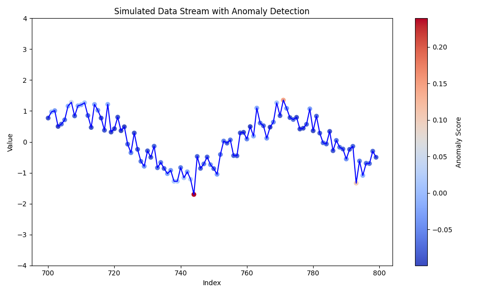

# Anomaly Detection with Concept Drift Handling

Author: `Vikas Kumar Sharma` (22RJ60R01, IIT Kharagpur)

This project showcases anomaly detection using the Isolation Forest algorithm along with handling concept drift in a streaming data scenario.

## Overview

The project demonstrates a Python-based anomaly detection system using Isolation Forest, capable of detecting anomalies in streaming data. It employs the `river` library for concept drift detection and adaptation.

## Algorithm selection

The algorithm selected for the anomaly detection system in this project is the Isolation Forest. This system is implemented using Python and leverages the river library, specifically designed for detecting concept drift in streaming data. The Isolation Forest algorithm, in conjunction with the river library, enables the detection of anomalies in real-time streaming data while also adapting to changing data patterns or concept drift.

### Reasons to IsolationForest:

- `**Speed and Scalability:**` Isolation Forest tends to be faster and more scalable than many traditional algorithms like k-means clustering or Gaussian Mixture Models (GMM) due to its ability to partition data efficiently in trees.

- `**Handling High-Dimensional Data:**` Unlike some algorithms such as k-nearest neighbors (KNN) or density-based methods like DBSCAN, Isolation Forest performs well in high-dimensional spaces without suffering from the curse of dimensionality.

- `**Robustness to Outliers:**` While methods like One-Class SVM (Support Vector Machine) might struggle with highly skewed or contaminated data, Isolation Forests naturally isolate anomalies, providing robustness against outliers.

- `**Adaptability to Streaming Environments:**` Compared to models that require periodic retraining like Moving Z-score or Exponential Weighted Moving Average (EWMA), Isolation Forests can adapt to changing data distributions in streaming settings without frequent retraining.

- `**Unsupervised Learning and Minimal Assumptions:**` Unlike techniques such as neural networks or some deep learning models, Isolation Forests require minimal hyperparameter tuning and no prior assumptions about the underlying data distribution, making them versatile and easier to deploy in various streaming data scenarios.

## Features

- Anomaly detection using Isolation Forest.
- Concept drift handling with the `river` library.
- Visualization of anomalies in a streaming data scenario.

## Installation

1. Clone the repository:

    git clone https://github.com/vkas9798/project_anomaly_detection_streaming_data.git

2. Install the required dependencies:

    pip install -r requirements.txt

## Usage

Run the main script `main.py` to start the anomaly detection visualization:

Figure 1: Snapshot of live streaming anomaly detection project (during runtime)

 Figure 2: Results saved in CSV format in results folder named as 'session_1.csv'

## Folder Structure

- **src/**: Contains Python source code.
    - **anomaly_detection.py**
    - **config_parser.py**
    - **logger.py**
    - **utils.py**
- **results/**: Directory to save detected anomalies CSV files.
- **requirements.txt**
- **config.ini**

## Code Documentation

The project code includes the following main files:

- `anomaly_detection.py`: Contains the `IsolationForestAnomalyDetection` class for anomaly detection with concept drift handling.
- `utils.py`: Utility functions for generating data, handling folders, and saving anomalies to CSV.
- `config_parser.py`: Contains parse_config function which returns tuple of required values from config.ini.
- `logger.py`: Initialize the logger for the anomaly detection system.
- `utils.py`: Contains various util function required for the project such as generate_data(), save_anomalies_to_csv(), etc
- `config.ini`: This is a config file, which have different parametric values, which have been used in this project.
- `requirements.txt`: File listing required Python packages.

## Contributing

Contributions are welcome! Feel free to open issues or submit pull requests for any improvements or bug fixes.

## License

This project is licensed under the Apache License. See the [LICENSE](./LICENSE) file for details.